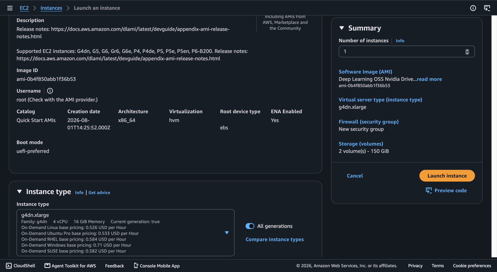
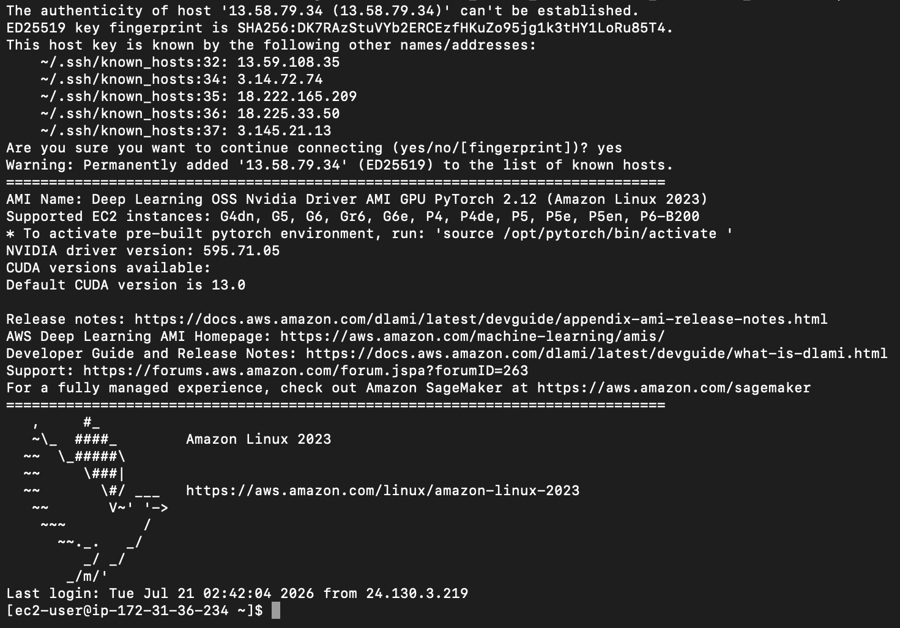
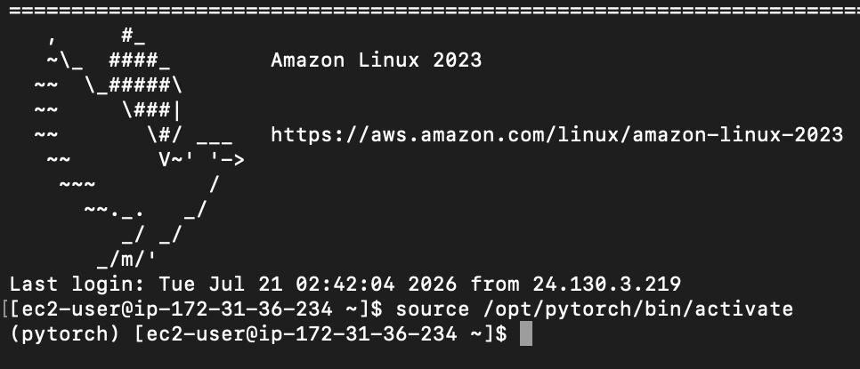
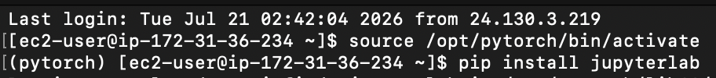
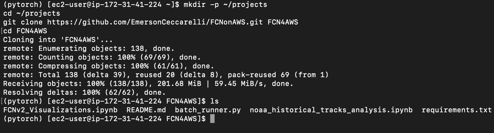
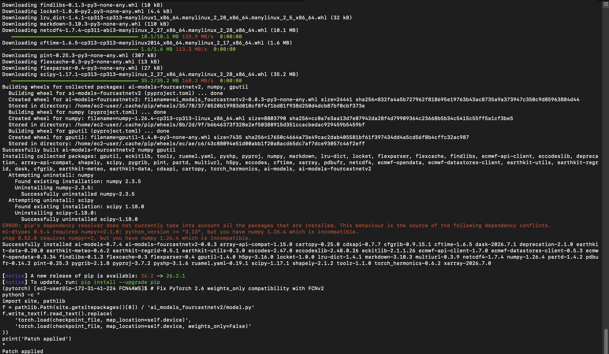
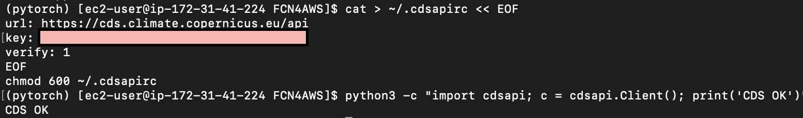
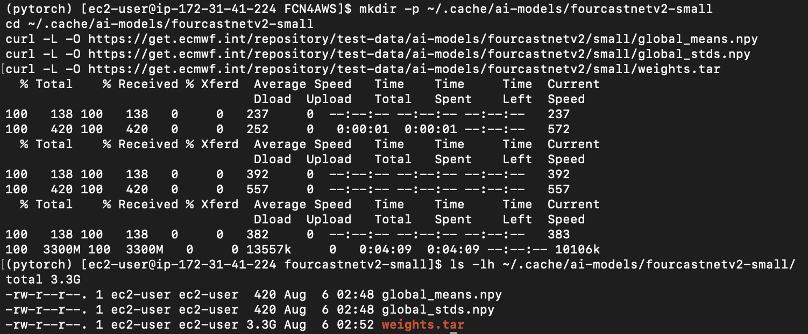
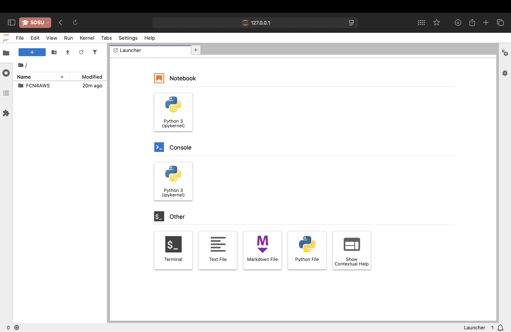

# SDSU SCIL AWS AI Weather Forecast — VM Setup Guide

##### by Emerson Ceccarelli
##### Suppervised by Distinguished Professor Samuel Shen

> This is the **`setup`** branch. It contains the one-time EC2/environment setup instructions in full detail, with screenshots for every step.
> For the research workflow, see the [`main` branch README](https://github.com/EmersonCeccarelli/FCNonAWS/blob/main/README.md).

---

## Initial VM Launch & Environment Setup

> Do this once on a fresh EC2 instance. After this setup is complete, the VM is ready for research — continue to the [`main` branch](https://github.com/EmersonCeccarelli/FCNonAWS/blob/main/README.md) for the research workflow.

### 1.1 Launch the EC2 Instance

In the AWS Console, launch a new instance with **exactly** these settings:

| Setting | Value |
|---|---|
| **AMI** | Deep Learning OSS Nvidia Driver AMI GPU PyTorch 2.12 (Amazon Linux 2023) |
| **Instance type** | `g4dn.xlarge` (Tesla T4, 16GB VRAM) |
| **Storage** | 60 GB gp3 |
| **Key pair** | Create a new `.pem` key pair and save it somewhere safe on your local machine |
| **Security group** | Allow SSH. Recommended: restrict to **My IP** only. Leaving open to `0.0.0.0/0` works but exposes port 22 to the internet (will need to update the rule if your IP changes) |

> **Note:** The `g4dn.xlarge` instance type is not typically available by default and may require customer service or specific AWS approval to access. Additionally, this instance type automatically attaches a 125 GB NVMe instance store volume (ephemeral0). This cannot be removed but should be free of charge. Data stored on it is lost when the instance is stopped or terminated, which is expected and acceptable since all research code lives in the GitHub repo.

Once the instance is running, copy the **Public IPv4 address** from the AWS Console.


*Screenshot: AWS Console "Launch an instance" screen showing AMI, instance type, storage, key pair, and security group settings.*

### 1.2 SSH Into the Instance

Run this from your local machine, substituting your `.pem` path and EC2 IP:

```bash
ssh -i "/path/to/your-key.pem" -L 8888:127.0.0.1:8888 ec2-user@<YOUR_EC2_IP>
```

The `-L 8888:127.0.0.1:8888` flag sets up the SSH tunnel so JupyterLab is accessible in your local browser at `http://127.0.0.1:8888`.

> **Note:** You should include the `-L` tunnel flag every time you SSH in if you plan to use JupyterLab.


*Screenshot: Terminal showing a successful SSH login banner for the EC2 instance.*

### 1.3 Activate the PyTorch Environment

The AMI ships with a pre-built PyTorch environment. Activate it:

```bash
source /opt/pytorch/bin/activate
```

You should see `(pytorch)` appear in your terminal prompt. All subsequent commands should be run inside this environment.


*Screenshot: Terminal prompt prefixed with `(pytorch)` after activation.*

### 1.4 Install JupyterLab

```bash
pip install jupyterlab
```


*Screenshot: Terminal output showing `pip install jupyterlab` finishing without errors.*

### 1.5 Set Up Project Directory & Clone the Repo

```bash
mkdir -p ~/projects
cd ~/projects
git clone https://github.com/EmersonCeccarelli/FCNonAWS.git FCN4AWS
cd FCN4AWS
```

> **Note:** you will be prompted for a github username and **passkey**
> **Note:** If you plan to push changes back to GitHub from this instance, you will need to complete step 1.9 (Git credentials) before your first `git push`. Cloning does not require credentials since the repo is public.


*Screenshot: Terminal showing the completed `git clone` and resulting directory listing.*

### 1.6 Install Python Dependencies

```bash
pip install -r requirements.txt
```

> **Note:** `cartopy` requires system-level `proj` and `geos` libraries. On Amazon Linux 2023 these are typically pre-installed on the Deep Learning AMI. If you see errors, run:
> ```bash
> sudo dnf install -y proj proj-devel geos geos-devel
> ```

> **Note:** You may see dependency conflict warnings about `ml-dtypes` and `shap` requiring a newer numpy. These are pre-installed AMI packages and can be safely ignored — they do not affect the FCNv2 pipeline.

```bash
# Fix PyTorch 2.6 weights_only compatibility with FCNv2
python3 -c "
import site, pathlib
f = pathlib.Path(site.getsitepackages()[0]) / 'ai_models_fourcastnetv2/model.py'
f.write_text(f.read_text().replace(
    'torch.load(checkpoint_file, map_location=self.device)',
    'torch.load(checkpoint_file, map_location=self.device, weights_only=False)'
))
print('Patch applied')
"
```


*Screenshot: Terminal showing `pip install -r requirements.txt` completing and "Patch applied" printed.*

### 1.7 Configure the CDS API Key (ERA5 Access)

Create a free account at https://cds.climate.copernicus.eu and retrieve your API key from your profile page. Then:

```bash
cat > ~/.cdsapirc << EOF
url: https://cds.climate.copernicus.eu/api
key: YOUR_API_KEY_HERE
verify: 1
EOF
chmod 600 ~/.cdsapirc
```

Test it:

```bash
python3 -c "import cdsapi; c = cdsapi.Client(); print('CDS OK')"
```


*Screenshot: CDS profile page showing the API key location, and/or terminal printing "CDS OK".*

### 1.8 Download FCNv2 Model Weights

The weights are ~3.3GB. Download them directly using `curl -L` (the `-L` flag is required to follow redirects):

```bash
mkdir -p ~/.cache/ai-models/fourcastnetv2-small
cd ~/.cache/ai-models/fourcastnetv2-small
curl -L -O https://get.ecmwf.int/repository/test-data/ai-models/fourcastnetv2/small/global_means.npy
curl -L -O https://get.ecmwf.int/repository/test-data/ai-models/fourcastnetv2/small/global_stds.npy
curl -L -O https://get.ecmwf.int/repository/test-data/ai-models/fourcastnetv2/small/weights.tar
```

Verify the downloads succeeded — `weights.tar` should be ~3.3GB:

```bash
ls -lh ~/.cache/ai-models/fourcastnetv2-small/
```

> **Note:** Do **not** use `ai-models --download-assets fourcastnetv2-small` — it fails due to incompatible `earthkit-data` and `numpy` versions on this AMI. The curl method above bypasses this entirely.


*Screenshot: Terminal `ls -lh` output confirming `weights.tar` is ~3.3GB.*

### 1.9 Launch JupyterLab

```bash
cd ~/projects
jupyter lab --no-browser --ip=127.0.0.1 --port=8888
```

> **Optional but recommended:** Wrap in `tmux` so JupyterLab survives SSH disconnects:
> ```bash
> tmux new -s jupyter
> cd ~/projects
> jupyter lab --no-browser --ip=127.0.0.1 --port=8888
> # Detach with Ctrl+B then D
> # Reconnect later with: tmux attach -t jupyter
> ```


*Screenshot: Local browser showing the JupyterLab file browser after connecting through the tunnel.*

---

## Next Steps

Setup is complete — the VM is ready for research. Continue to the **Research Workflow** section on the [`main` branch README](https://github.com/EmersonCeccarelli/FCNonAWS/blob/main/README.md).
