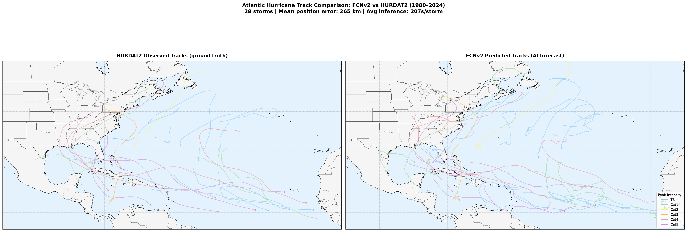
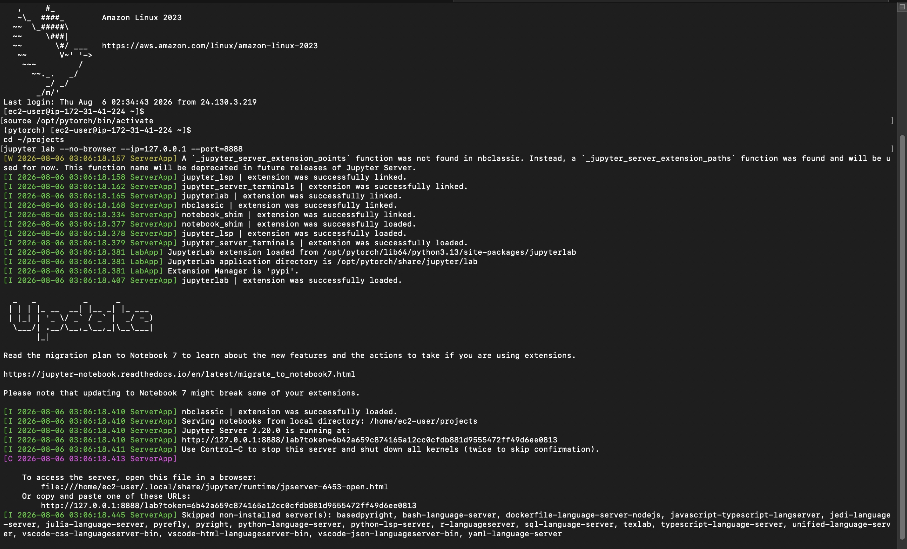
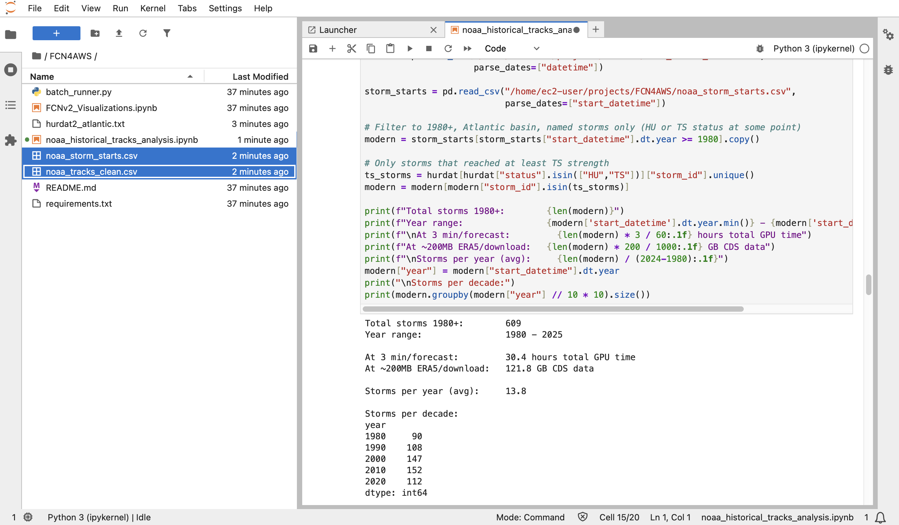
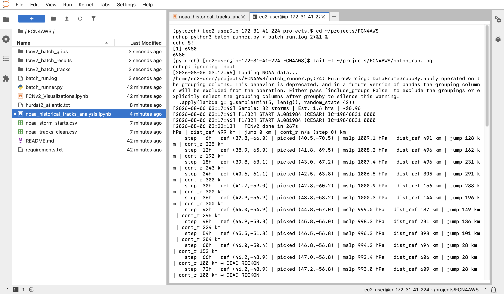
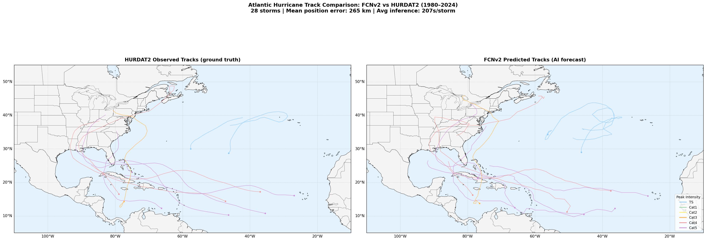

# SDSU SCIL AWS AI Weather Forecast

##### by Emerson Ceccarelli
##### Suppervised by Distinguished Professor Samuel Shen

---

## Project Overview



Evaluate NVIDIA's FourCastNetV2 (FCNv2) AI weather model against NOAA HURDAT2 ground truth for Atlantic hurricane track forecasting. Runs on an AWS EC2 GPU instance via JupyterLab.

**Research question:** How accurately does FCNv2 predict Atlantic hurricane tracks compared to observed HURDAT2 data?

**Pipeline summary:**

```
HURDAT2 (NOAA) → noaa_historical_tracks_analysis.ipynb → noaa_data/
                                                              ↓
                                              batch_runner.py (called by notebook)
                                              ERA5 via CDS API → FCNv2 inference
                                                              ↓
                                          FCNv2_Visualizations.ipynb → plots & stats
```

---

## VM Setup (one-time)

Full step-by-step EC2/environment setup instructions, with screenshots for every step, are maintained on the [`setup` branch](https://github.com/EmersonCeccarelli/FCNonAWS/blob/setup/README-setup.md). Complete that setup once before using the workflow below.

---

## Research Workflow

Once the VM is set up, every subsequent session starts here.

### Connect to an Instance

Each time you restart your session, SSH in with the tunnel flag (the IP will likely change if the instance was stopped — check the AWS Console):

```bash
ssh -i "/path/to/your-key.pem" -L 8888:127.0.0.1:8888 ec2-user@<YOUR_EC2_IP>
source /opt/pytorch/bin/activate
tmux attach -t jupyter   # reattach to existing JupyterLab session if applicable
```

Then open `http://127.0.0.1:8888` in your browser.


<!--
*Screenshot: Terminal showing successful SSH reconnect and `tmux attach` into the running JupyterLab session.*
-->

### Step 1 — Generate NOAA Data

Open and run **`noaa_historical_tracks_analysis.ipynb`** cells 1 through 14.

Downloads HURDAT2 from NOAA, cleans and parses it, and writes to `noaa_data/`:
- `noaa_tracks_clean.csv` — full track records for all Atlantic storms
- `noaa_storm_starts.csv` — one row per storm with genesis time, location, and category


<!--
*Screenshot: JupyterLab notebook after running all cells, showing the `noaa_data/` output files.*
-->

### Step 2 — Run Batch FCNv2 Inference

The batch runner is a long-running process (~1.7 hrs for 32 storms). Run it from a terminal tab in JupyterLab, not from the notebook:

```bash
cd ~/projects/FCN4AWS
nohup python3 batch_runner.py > batch_run.log 2>&1 &
echo $!
```

Monitor progress:

```bash
tail -f ~/projects/FCN4AWS/batch_run.log
```

The runner skips storms that already have a track file in `fcnv2_batch_tracks/` — safe to restart after interruption. GRIBs are deleted after each storm to manage disk space. When complete, results are saved to `fcnv2_batch_results/batch_results.csv`.


<!--
*Screenshot: Terminal showing `tail -f batch_run.log` with storms processing.*
-->

### Step 3 — Visualize Results

Return to **`noaa_historical_tracks_analysis.ipynb`** and run the final four cells. These generate spaghetti plots and error analysis comparing FCNv2 predicted tracks against HURDAT2 ground truth, and save the output PNGs to the project directory.


<!--
*Screenshot: Example output plot comparing FCNv2 predicted tracks against HURDAT2 ground truth.*
-->

---

## File Structure

```
FCN4AWS/
├── noaa_historical_tracks_analysis.ipynb   # Step 1 & 3: NOAA data download, cleaning, and visualizations
├── batch_runner.py                          # Step 2: FCNv2 batch inference engine
├── FCNv2_Visualizations.ipynb              # Additional visualization and analysis cells
├── requirements.txt
├── .gitignore
└── README.md

# Generated on first run (gitignored — not in repo):
├── noaa_tracks_clean.csv           # full track records for all Atlantic storms
├── noaa_storm_starts.csv           # one row per storm with genesis time, location, and category
├── fcnv2_batch_gribs/              # temp GRIB storage, deleted after each storm
├── fcnv2_batch_tracks/             # per-storm FCNv2 track CSVs
└── fcnv2_batch_results/
    └── batch_results.csv

# Lives outside the repo (set up during VM setup):
~/.cdsapirc                         # CDS API credentials
~/.cache/ai-models/                 # FCNv2 model weights (~3.3GB)
```

---

## Cost Estimate

| Resource | Rate | Estimated total |
|---|---|---|
| `g4dn.xlarge` on-demand | ~$0.526/hr | ~609 storms × ~3 min each ≈ 30 hrs ≈ **$16** |
| EBS storage (60GB gp3) | ~$0.08/GB/month | ~**$5/month** |

Stop the instance when not in use to avoid unnecessary charges.

---

## References

- [FourCastNetV2 — NVIDIA](https://github.com/NVlabs/FourCastNet)
- [ai-models — ECMWF](https://github.com/ecmwf-lab/ai-models)
- [HURDAT2 dataset — NOAA](https://www.nhc.noaa.gov/data/#hurdat)
- [Copernicus CDS — ERA5](https://cds.climate.copernicus.eu)
- Original FCN4AWS tutorial repo: https://github.com/ikhadir/FCN4AWS
